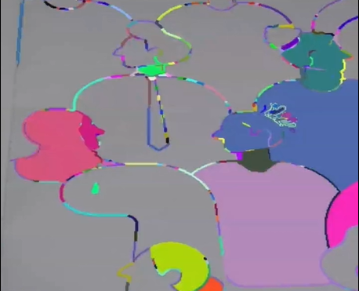

# ColorWizard 🎨

> ⚠️ IMPORTANT: The current project is in development and experimental.



ColorWizard is a Python-based project that aims to automate the coloring process of physical coloring books. It uses computer vision techniques to scan and detect the regions in a coloring book page, and then automatically applies colors to those regions, creating a digitally colored version of the page.

## Features

-   **Region Segmentation**: The project employs image processing algorithms to segment the coloring book page into distinct regions, each representing a separate area to be colored.

## Installation

1. Clone the repository:

    ```bash
    git clone https://github.com/kherin/ColorWizard.git
    ```

2. Navigate to the project directory:

`cd ColorWizard`

3. Install the required dependencies:

`pip install -r requirements.txt`

## Usage

Run the ColorWizard server:

`python server.py`

Open your web browser and navigate to the provided URL (e.g., http://localhost:5000).

_Process_video.py_ 📄

The process_video.py file contains the core functionality for processing the coloring book pages. It imports the necessary libraries and defines functions to perform the following tasks:

Image Preprocessing: This function prepares the uploaded image for further processing by resizing, converting to grayscale, and applying various filters and transformations.
Region Segmentation: This function uses computer vision algorithms to segment the coloring book page into distinct regions, each representing a separate area to be colored.

The process_video.py file is imported and utilized by the server application (server.py) to handle the image processing and coloring tasks.

_video_capture.html_ 📄

The video_capture.html file is an HTML template that provides the user interface for the ColorWizard web application.

## Contributing

Contributions to ColorWizard are welcome! If you find any issues or have suggestions for improvements, please open an issue or submit a pull request on the project's GitHub repository.

## Acknowledgments

The project utilizes the following open-source libraries and frameworks:
OpenCV for image processing and computer vision tasks.
NumPy for numerical computations.
Flask for the web application framework.
